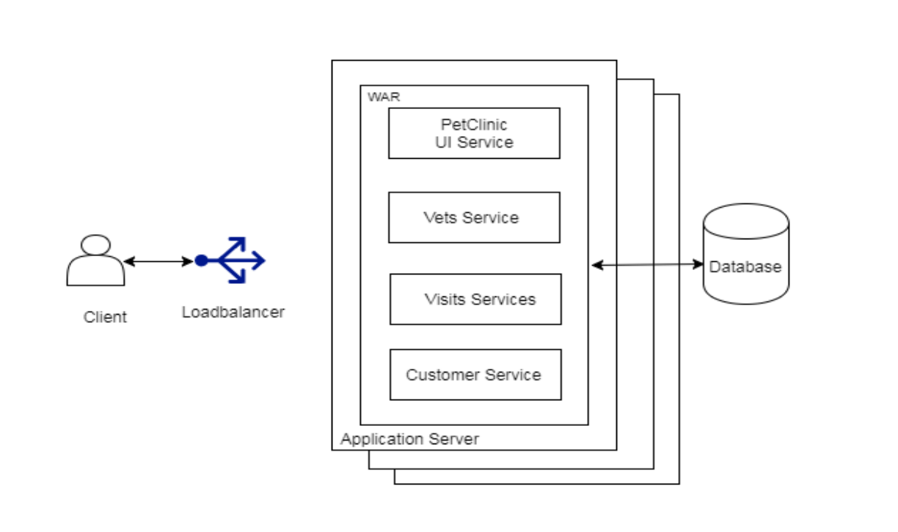
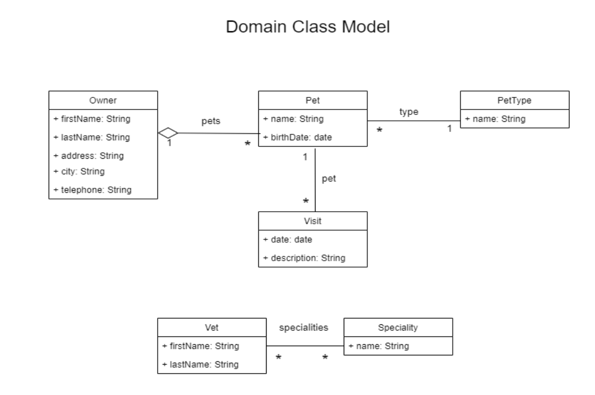
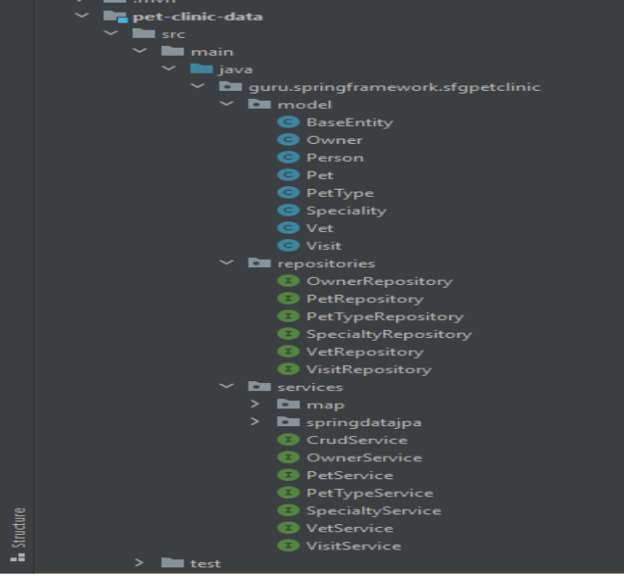
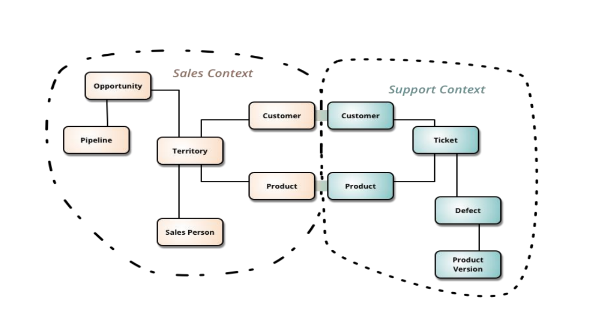
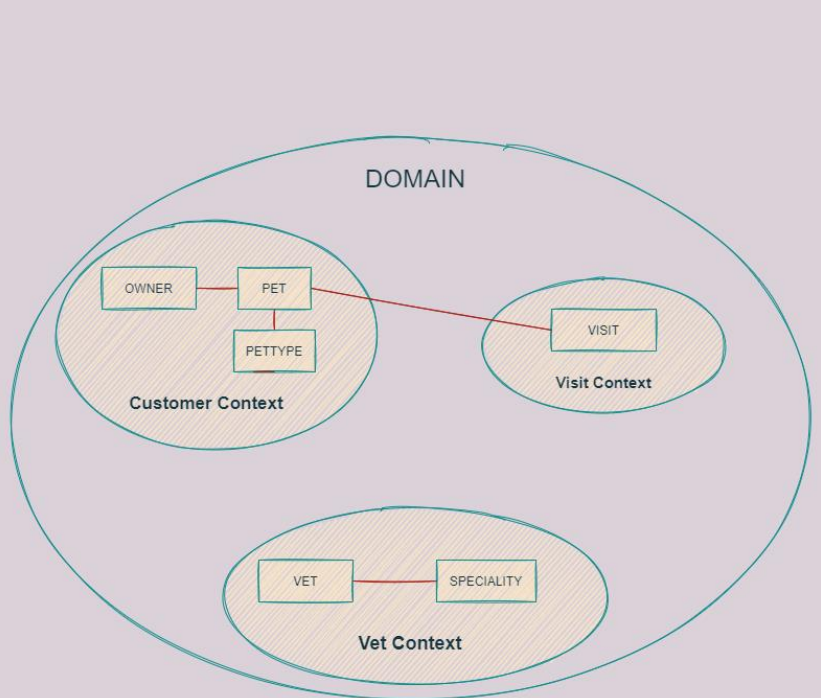
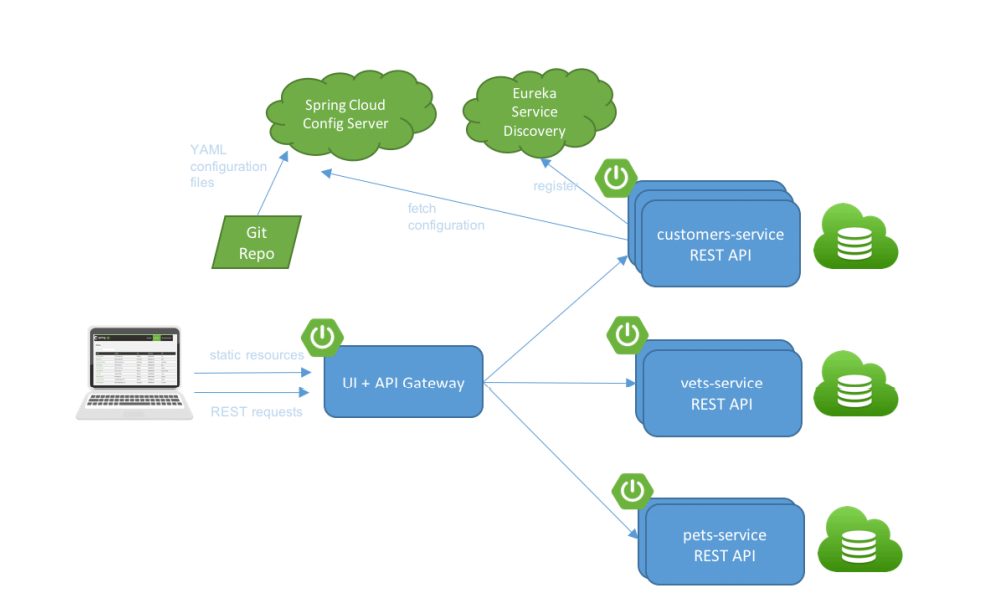
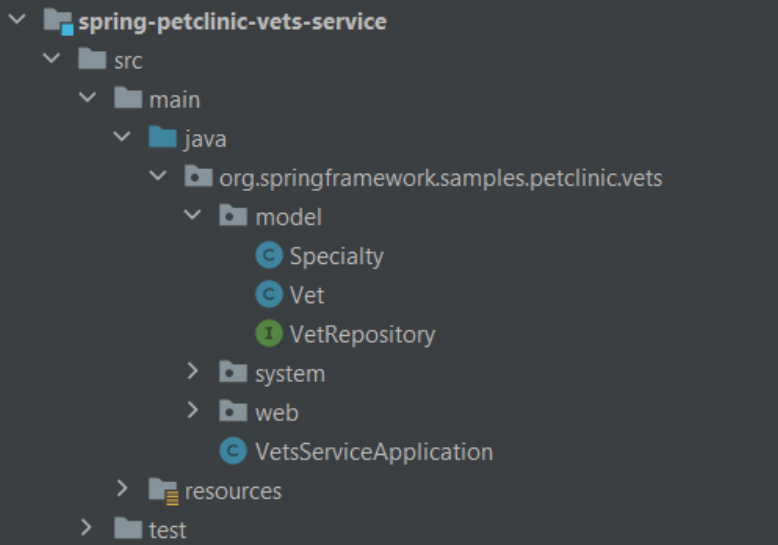
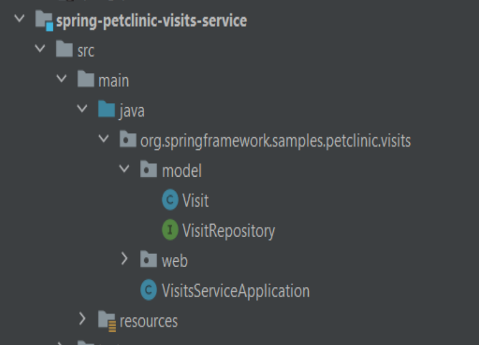
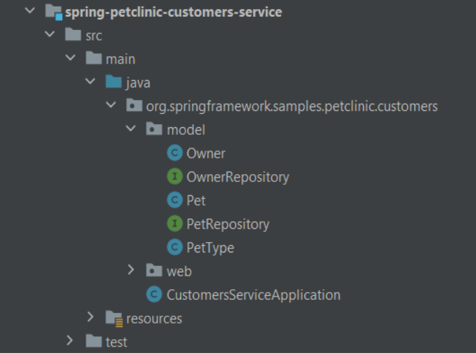

# SPRING-PETCLINIC APPLICATION
## Monolithic Petclinic

- PetClinic, Spring MVC ve Spring Data ile Spring Boot kullanımını gösteren bir uygulamadır. PetClinic örnek uygulaması, Spring Framework’un basit ama güçlü
veri tabanı odaklı uygulamalar oluşturmak için nasıl kullanılabileceğini göstermek için
tasarlanmıştır.

- Bu uygulama, Model-View-Controller kullanılarak JDBC, Hibernate veya Java
Persistence API aracılığıyla pratik ve faydalı altyapı sağlayan Spring Framework ile
geliştirilmiştir.

- Uygulamanın kullanıcıları, çalışmaları sırasında veteriner hekimler, müşteriler ve
evcil hayvanları ile ilgili bilgileri görüntülemesi ve yönetmesi gereken klinik
çalışanlarıdır.

- PetClinic uygulamasının her interface inin bağımlılıklarını oluşturmak için, şekildeki
gibi domain modelini değerlendirmek önemlidir.

Owner, Pet, Vet, PetType ,Visit ve Speciality sınıflarına ait class diagramı:

- Domain, interfaceler ve model sınıfları bilindiğinde, iş fonksiyonları ve
interfacelerle ilgili repository işlevleri tanımlanmalıdır.

- Monolitik PetClinic Hiyerarşisi:

   

- Monolit mimari , topluluk tarafından yeniden düzenlendi ve microservice mimariye
geçildi.

- Zuul'daki bağımlılıklar kaldırıldı, notifications ve Kafka Service eklendi.

# Microservice ve Domain-Driven Design

- DDD'nin stratejik tasarım bölümünün odak noktası, büyük modeller ve ekiplerle
uğraşmaktır. Bounded Context , Domain Driven Design tasarımda merkezi bir kalıptır. DDD, büyük modelleri farklı Bounded Contextlere bölerek aralarındaki
ilişkilerle ilgilenir.

- Domain-Driven Design (DDD), kullanım durumlarınızla ilgili olarak işin gerçekliğine
dayalı modellemeyi savunur. Uygulama oluşturma bağlamında, DDD sorunlardan domain olarak bahseder. Bağımsız issue alanlarını Bounded Context olarak tanımlar
(her Bounded Context genelde bir mikro servisle ilişkilidir).

- Ayrıca, DDD yaklaşımları yalnızca önemli iş kurallarına sahip karmaşık mikro
servisler uyguluyorsanız uygulanmalıdır.

- Bir mikro hizmeti tasarlarken ve tanımlarken, sınırların nerede çizileceği kilit
görevdir. DDD kalıpları, domaindeki karmaşıklığı anlamanıza yardımcı olur.

- Her bounded contextin domain modeli için, domaini modelleyen entitiyleri
tanımlarsınız.

- Contextinizi tanımlayan bir sınır içinde yer alan bir domain modeli oluşturursunuz. Bu
sınırlar içindeki bileşenler sonunda sizin mikroservisleriniz olur, ancak bazı
durumlarda bir bounded context veya iş mikroservisleri birkaç fiziksel servisten
oluşabilir.

- Örneğin Spring PetClinic uygulaması monolitik mimariden mikroservis mimarisine
geçirilirken öncesinde bounded contextler oluşturulsa mikroservislere daha rahat
ayrıştırma yapılabilir.

- Aralarındaki entity relationshiplerden de yola çıkarak Owner-Pet-PetType entitylerini
bir contexte(customer), Vet-Speciality entitylerini bir contexte(Vet), Visit entitysini ise
başka bir contextte(Visit) sınırlandırabiliriz.

- Bounded contextleri belirledikten sonra microservisleri inşa edebiliriz.

- Spring Petclinic Microservices, bir REST API aracılığıyla HTTP üzerinden iletişim
kuran küçük bağımsız servisler etrafında inşa edilmiştir.

- PetClinic, 4 temel mikroservise ayrıştırılmıştır. Hepsi, business domain tarafından
düzenlenen bağımsız olarak dağıtılabilir uygulamalardır.

* Customers service: Pets , Owners ve PetType bilgilerini(İsim, Adres, Şehir,
Telefon) dahil olmak üzere genel kullanıcı girişini ve validasyonunu içerir.

* Visits service: Her evcil hayvanın yorumları için ziyaret bilgilerini saklar ve
gösterir.

* Vets service: İsimler ve uzmanlık alanları da dahil olmak üzere Veterinerlerin
bilgilerini saklar ve gösterir.

* API Gateway:API Gateway , requestleri işlemek ve bunları uygun bir servise
yönlendirmek veya birden çok servisi için kullanılan sisteme tek bir giriş
noktasıdır. Üç temel servis, istemciye harici bir API sunar.

Yeşil renkteki infrastructure mikro servisler:

* Eureka servisi, mikro servislerin IP adreslerini önceden bilmeden kaydolmalarına ve
ardından iletişim kurmalarına izin verecektir.

* Mikro servisler(ve diğer sunucular) uygulama configürasyonlarını Config Server dan
yükleyecektir. Configürasyon dosyaları Spring-petclinic-microservices-config-GitHub
kod deposunda sürümlendirilir.

* İsteğe bağlı olarak, farklı çağrılar Zipkin dağıtılmış günlük sunucusuna kadar
izlenebilir.

* Son olarak, çeşitli mikro servisleri izlemek ve yönetmek için Ops, Spring Boot Admin
sunucusuna güvenebilir.

4 mikro servis yani customer, vet, visit ve api-gateway'in her biri Spring Boot
alanında bir uygulamadır. Her birinin birkaç Java sınıfı ve yapılandırma dosyası
içeren kendi Maven modülü vardır.

Örneğin, pet service modülünün aşağıda da görüldüğü gibi 4 üyesi vardır: Vet , Speciality , VetRepository ve VetServiceApplication

  
